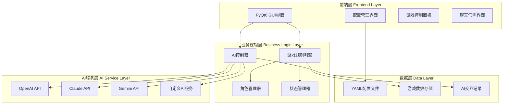

# AI游戏测试平台 - 架构设计

## 系统架构概览



## 技术栈选择

### 前端技术
- **PyQt6**: 跨平台GUI框架，提供丰富的UI组件
- **QSS**: Qt样式表，用于界面美化
- **Qt Designer**: 可视化界面设计工具

### 后端技术
- **Python 3.8+**: 主要编程语言
- **PyYAML**: YAML配置文件解析
- **Requests**: HTTP请求库，用于API调用
- **SQLite/JSON**: 数据存储方案

### AI服务集成
- **OpenAI API**: GPT系列模型
- **Anthropic API**: Claude系列模型
- **Google API**: Gemini系列模型
- **自定义适配器**: 支持其他AI服务

## 核心模块设计

### 1. 主应用程序模块 (Main App)
```python
class MainApplication:
    - config_manager: ConfigManager
    - game_engine: GameEngine
    - ai_controller: AIController
    - ui_manager: UIManager
```

### 2. 配置管理模块
```python
class ConfigManager:
    - load_config(): 加载YAML配置
    - save_config(): 保存配置更改
    - validate_config(): 配置验证
    - get_ai_providers(): 获取AI提供商列表
```

### 3. AI控制器模块
```python
class AIController:
    - providers: List[AIConnector]
    - send_message(provider, message): 发送消息
    - get_response(): 获取AI响应
    - manage_conversations(): 对话管理
```

### 4. 游戏引擎模块
```python
class GameEngine:
    - game_state: GameState
    - players: List[Player]
    - roles: Dict[str, Role]
    - process_turn(): 处理回合
    - check_win_condition(): 检查胜利条件
```

### 5. UI管理模块
```python
class UIManager:
    - main_window: MainWindow
    - config_dialog: ConfigDialog
    - game_panel: GamePanel
    - chat_widget: ChatWidget
```

## 数据流设计

### 配置数据流
```
用户界面 -> 配置修改 -> YAML文件 -> 配置管理器 -> 各业务模块
```

### 游戏数据流
```
游戏引擎 -> 游戏状态 -> UI显示 -> 用户操作 -> 引擎处理
```

### AI交互数据流
```
用户/AI输入 -> AI控制器 -> API调用 -> 响应处理 -> UI显示
```

## 文件结构设计

```
AI-CHAT/
├── werewolf-game/          # 狼人杀游戏主模块
│   ├── src/
│   │   ├── main.py         # 主程序入口
│   │   ├── app.py          # 应用程序类
│   │   ├── config_manager.py
│   │   ├── game_engine.py
│   │   ├── ai_controller.py
│   │   ├── ui/
│   │   │   ├── main_window.py
│   │   │   ├── config_dialog.py
│   │   │   ├── game_panel.py
│   │   │   └── chat_widget.py
│   │   └── models/
│   │       ├── player.py
│   │       ├── role.py
│   │       └── game_state.py
│   ├── config/
│   │   ├── config.yaml     # 主配置文件
│   │   └── roles.yaml      # 角色定义文件
│   ├── assets/
│   │   ├── icons/          # 图标资源
│   │   └── styles/         # 样式文件
│   └── requirements.txt    # 依赖包列表
├── common/                 # 公共组件
│   ├── ai_providers/      # AI服务提供商实现
│   │   ├── openai_provider.py
│   │   ├── claude_provider.py
│   │   └── base_provider.py
│   └── utils/             # 工具函数
│       ├── file_utils.py
│       ├── validation.py
│       └── logger.py
├── docs/                  # 文档
│   ├── API.md            # API文档
│   ├── DEVELOPMENT.md    # 开发指南
│   └── GAMERULES.md      # 游戏规则
└── tests/                # 测试代码
    ├── unit_tests/       # 单元测试
    └── integration_tests/# 集成测试
```

## 接口设计

### AI提供商接口
```python
class BaseAIProvider(ABC):
    @abstractmethod
    def send_message(self, message: str, **kwargs) -> str:
        pass
    
    @abstractmethod
    def get_models(self) -> List[str]:
        pass
    
    @abstractmethod
    def validate_config(self, config: dict) -> bool:
        pass
```

### 游戏角色接口
```python
class Role(ABC):
    @abstractmethod
    def night_action(self, game_state):
        pass
    
    @abstractmethod
    def day_action(self, game_state):
        pass
    
    @abstractmethod
    def get_description(self) -> str:
        pass
```

## 性能考虑

1. **API调用优化**: 使用异步IO处理多个AI请求
2. **内存管理**: 合理管理游戏状态和聊天历史
3. **响应式UI**: 确保界面流畅，避免阻塞主线程
4. **数据持久化**: 定期保存游戏进度和配置

## 扩展性设计

1. **插件架构**: 支持动态加载新的游戏模块
2. **配置驱动**: 通过配置文件添加新角色和规则
3. **API适配器**: 易于集成新的AI服务提供商
4. **主题系统**: 支持界面主题切换

## 安全考虑

1. **API密钥安全**: 加密存储敏感配置信息
2. **输入验证**: 防止注入攻击和恶意输入
3. **数据隔离**: 确保不同游戏会话的数据隔离
4. **错误处理**: 完善的异常处理和日志记录