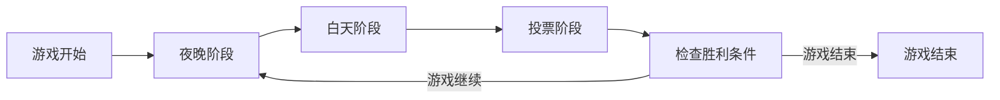

# 狼人杀游戏规则

## 游戏概述

狼人杀是一款推理类社交游戏，玩家分为狼人阵营和村民阵营，通过发言、推理和投票来达成各自阵营的胜利条件。

## 游戏阵营

### 1. 村民阵营 (Villager Team)
- **目标**: 找出并投票处决所有狼人
- **成员**: 普通村民 + 神职角色
- **颜色标识**: 绿色

### 2. 狼人阵营 (Werewolf Team)  
- **目标**: 消灭所有村民或神职角色
- **成员**: 狼人
- **颜色标识**: 红色

## 角色介绍

### 狼人阵营角色

#### 🐺 狼人 (Werewolf)
- **能力**: 每晚可以共同商议并杀死一名玩家
- **行动时间**: 夜晚阶段
- **优先级**: 高
- **胜利条件**: 狼人数量 ≥ 存活玩家数量

### 村民阵营角色

#### 👨‍🌾 村民 (Villager)
- **能力**: 无特殊能力，依靠投票和推理
- **行动时间**: 无
- **优先级**: 低
- **胜利条件**: 所有狼人被消灭

#### 🔮 预言家 (Prophet)
- **能力**: 每晚可以查验一名玩家的真实身份
- **行动时间**: 夜晚阶段（狼人之后）
- **优先级**: 中
- **查验结果**: 显示"狼人"或"好人"

#### 🧙‍♀️ 女巫 (Witch)
- **能力**: 拥有一瓶解药和一瓶毒药
  - **解药**: 可以救活当晚被狼人杀死的玩家
  - **毒药**: 可以毒死一名玩家
- **限制**: 每晚只能使用一瓶药，全程只能使用一次解药
- **行动时间**: 夜晚阶段（预言家之后）
- **优先级**: 中

#### 🏹 猎人 (Hunter)
- **能力**: 被狼人杀死或投票处决时，可以开枪带走一名玩家
- **限制**: 被女巫毒死不能开枪
- **行动时间**: 死亡时立即
- **优先级**: 中

#### 🤪 白痴 (Idiot)
- **能力**: 被投票处决时不会死亡，但失去投票权
- **限制**: 被狼人杀死正常死亡
- **行动时间**: 被投票时
- **优先级**: 低

## 游戏流程

### 游戏阶段循环



### 1. 夜晚阶段 (约60秒)
**执行顺序**:
1. **狼人行动**: 选择一名玩家杀害
2. **预言家行动**: 选择一名玩家查验身份
3. **女巫行动**: 选择使用解药或毒药

### 2. 白天阶段 (约120秒)
1. **公布死亡信息**: 显示昨晚的死亡情况
2. **玩家发言**: 按顺序发言讨论
3. **投票环节**: 投票处决嫌疑人

### 3. 投票规则
- 所有存活玩家投票
- 得票最多的玩家被处决
- 平票时无人被处决
- 被处决玩家揭示身份

## 胜利条件

### 村民阵营胜利
- 所有狼人被找出并投票处决

### 狼人阵营胜利
- 狼人数量 ≥ 存活玩家数量
- 所有神职角色被消灭

### 平局条件
- 游戏达到最大回合数（如15回合）
- 特殊规则触发平局

## AI玩家行为规则

### 发言规则
```yaml
ai_behavior:
  conversation_style: "strategic"  # strategic/random/roleplay
  min_response_length: 20
  max_response_length: 200
  include_emotions: true
  use_strategy: true
```

### 策略模式
1. **战略模式**: 基于逻辑推理发言
2. **角色扮演模式**: 符合角色性格的发言  
3. **随机模式**: 随机生成发言内容

### 投票逻辑
- 基于发言内容分析
- 考虑角色身份概率
- 遵循阵营利益最大化

## 特殊规则

### 首夜保护
- 第一晚女巫默认自动使用解药（可选规则）
- 防止游戏过早结束

### 遗言规则
- 被狼人杀害的玩家有遗言
- 被投票处决的玩家有遗言
- 遗言次数限制（如前三夜有遗言）

### 警长规则（可选）
- 第一天选举警长
- 警长有1.5票投票权
- 警长决定发言顺序

## 游戏设置选项

### 基本设置
```yaml
player_count: 8           # 玩家数量
game_speed: "normal"      # slow/normal/fast
time_limits:              # 时间限制(秒)
  night: 60
  day: 120  
  vote: 30
```

### 角色配置
```yaml
roles:
  werewolf: 2    # 狼人数量
  villager: 4    # 村民数量  
  prophet: 1     # 预言家数量
  witch: 1       # 女巫数量
  hunter: 0      # 猎人数量
  idiot: 0       # 白痴数量
```

### 高级选项
```yaml
advanced:
  first_night_protection: true  # 首夜保护
  last_words: true              # 遗言功能
  sheriff: false                # 警长模式
  max_rounds: 15                # 最大回合数
```

## AI提示词设计

### 角色提示词模板
```
你正在玩狼人杀游戏，你的身份是{role}。

游戏背景：
{game_situation}

你的目标：
{win_condition}

当前阶段：{phase}
你的行动：{action}

请根据你的角色和当前情况做出决策。
```

### 发言提示词
```
请以{role}的身份发言，风格：{style}
当前局势：{situation}
你的推理：{reasoning}
发言要求：{requirements}
```

## 游戏状态管理

### 状态数据结构
```python
class GameState:
    phase: str              # night/day/vote
    round: int              # 当前回合
    players: List[Player]   # 所有玩家
    alive_players: List[Player]  # 存活玩家
    dead_players: List[Player]   # 死亡玩家
    events: List[Event]     # 游戏事件记录
    settings: GameSettings  # 游戏设置
```

### 事件记录
```python
class Event:
    type: str       # kill/vote/check/poison/save
    round: int      # 发生回合
    phase: str      # 发生阶段
    source: Player  # 发起者
    target: Player  # 目标
    result: Any     # 结果
```

## 扩展规则

### 新增角色建议
1. **守卫**: 每晚可以守护一名玩家免遭狼人杀害
2. **丘比特**: 首夜选择两名玩家成为情侣，情侣同生共死
3. **盗贼**: 首夜从额外身份牌中选择一个身份

### 变体规则
1. **混血儿**: 首夜选择支持一个阵营
2. **野孩子**: 首夜选择一个榜样，榜样死亡后变成狼人
3. **狐狸**: 每晚可以查验三名玩家中是否有狼人

## 平衡性调整

### 角色平衡
- 根据玩家数量调整角色比例
- 确保双方阵营胜率接近50%
- 考虑角色能力强度平衡

### 游戏节奏
- 调整时间限制适应不同玩家水平
- 提供快速游戏模式选项
- 支持暂停和继续功能

## 裁判规则

### 自动裁判
- 系统自动执行游戏规则
- 检测违规行为
- 处理平票等特殊情况

### 手动干预
- 支持用户手动控制游戏进程
- 可以override自动决策
- 提供回退和重做功能

## 数据记录

### 游戏统计
- 胜负记录
- 角色表现分析
- AI决策质量评估
- 玩家互动模式

### 性能指标
- API响应时间
- 决策准确性
- 游戏完成率
- 用户体验评分